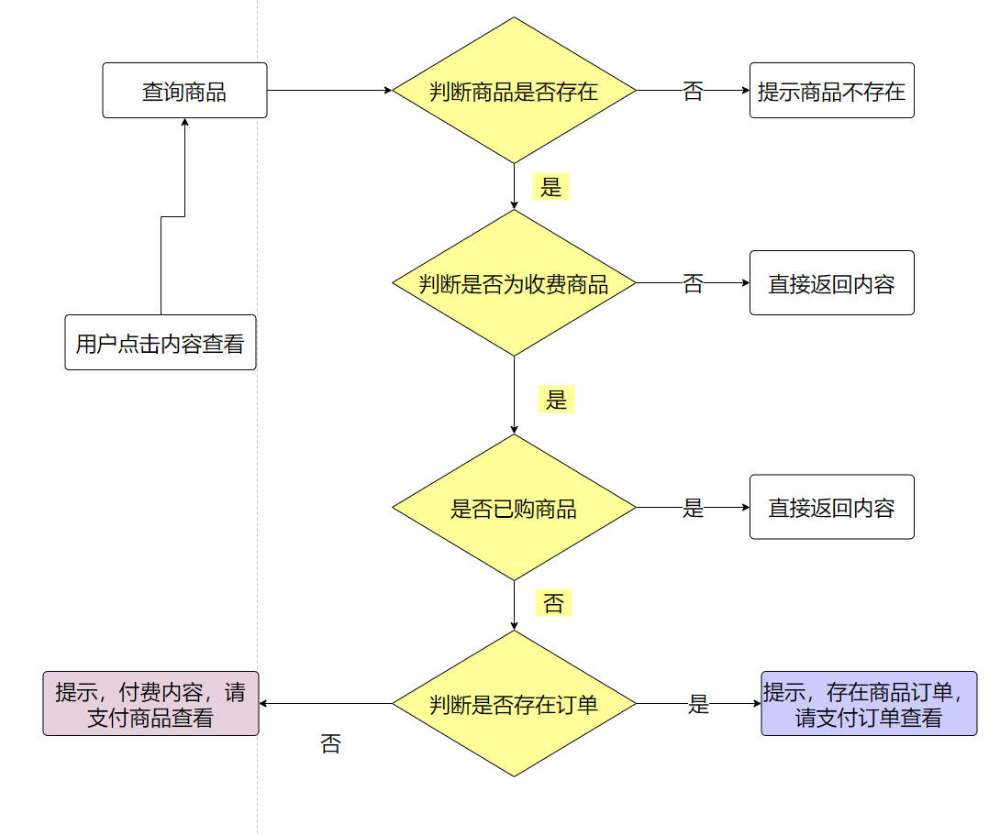

# 赞赏平台系统详细文档

> 作者：三哥
>
> 系统线上地址：http://admire.j3code.cn
>
> 系统介绍：https://www.bilibili.com/video/BV1t84y1V7Nk/
>
> 前端代码：http://git.j3code.cn/my-git/J3code/admire-platform-web.git
>
> 后端代码 + sql：http://git.j3code.cn/my-git/J3code/admire-platform.git
>
> 文章：https://juejin.cn/post/7199820362954588197
>
> 说明：本系统有视频分析、文档笔记（只有后端）、全部代码（前后端）
>
> - 视频分析：B站公开
> - 笔记 + 代码：赞赏平台获取
> - 代码是私有仓库，记得添加三哥微信发送支付截图让他拉你进仓库
> 

# 1、业务描述

管理员主业务：

1、添加商品（免费、收费）

用户主业务：

1、商品首页数据任何用户都可查看、其余数据一律登录查看

2、用户登录、注册、注销

3、商品详情、隐藏内容查看

4、免费内容直接展示给用户、收费内容需支付后方可查看

5、用户订单列表，可点击订单直达商品详情、如有未支付订单可直接点击支付进行付款

6、用户详情编辑

**重点业务**：

1、登录认证

2、token 续约

3、支付

4、订单状态修改

# 2、项目技术选择

**后端**：

Java 环境：JDK11

基础框架：SpringBoot 2.5+

微服务：SpringCloud 2020.0.4、SpringCloud Alibaba、Nacos、Gateway、Open Feign

数据库：MySQL、Redis

加密：jasypt

对象转化：mapstruct

其它：fastjson、druid、hutool、lombok、阿里支付

**前端**：

框架：Vue2、Ant Design Vue 2+、qrcode

# 3、实体抽象及表设计

## 3.1 实体抽象

用户

- id
- 昵称
- 账户
- 密码
- 商户订单号（也是一个登录账号）
- 性别
- 头像
- 个性签名
- 注册类型（默认注册、支付注册）
- 标签
- 创建时间
- 创建人
- 修改时间
- 修改人

标签

- id
- 类型（用户标签、商品标签）
- 名称
- 序号
- 描述
- 热度（根据热度进行搜索，推荐）
- 创建时间
- 创建人
- 修改时间
- 修改人

商品

- id
- 名称
- 类型（免费、收费）
- 价格
- 标签
- 描述链接
- 内容（需付费的内容）
- 购买人数
- 查看人数
- 创建时间
- 创建人
- 修改时间
- 修改人

订单

- id
- 用户id
- 商品id
- 支付状态（已支付、未支付）
- 金额
- **回调url**
- 支付渠道（**支付宝**、微信、银联）
- 支付二维码
- 二维码过期时间
- 创建时间
- 创建人
- 修改时间
- 修改人

流水表

- id
- 用户id
- 订单id
- 变动金额
- 变动类型（注册、赞赏）
- 创建时间
- 创建人
- 修改时间
- 修改人

用户商品中间表（**已购买**）

- id
- 用户id
- 商品id
- 创建时间
- 创建人
- 修改时间
- 修改人

## 3.2 表创建

数据库：admire-platfrom

```sql
CREATE DATABASE /*!32312 IF NOT EXISTS*/`admire-platform` /*!40100 DEFAULT CHARACTER SET utf8mb4 COLLATE utf8mb4_german2_ci */;

USE `admire-platform`;
```

用户表

```sql
CREATE TABLE `ap_user` (
  `id` bigint(20) NOT NULL AUTO_INCREMENT,
  `username` varchar(32) COLLATE utf8mb4_german2_ci DEFAULT NULL COMMENT '账号',
  `password` varchar(150) COLLATE utf8mb4_german2_ci DEFAULT NULL COMMENT '密码',
  `order_number` varchar(32) COLLATE utf8mb4_german2_ci DEFAULT NULL COMMENT '订单编号（付款注册用户，可通过交易商户订单号直接登录，商户订单号可在支付宝交易记录中查看）',
  `nickname` varchar(20) COLLATE utf8mb4_german2_ci DEFAULT NULL COMMENT '昵称',
  `head_picture` varchar(500) COLLATE utf8mb4_german2_ci DEFAULT NULL COMMENT '头像:url',
  `sex` tinyint(1) DEFAULT '1' COMMENT '性别',
  `signature` varchar(500) COLLATE utf8mb4_german2_ci DEFAULT NULL COMMENT '个性签名',
  `register_type` int(1) NOT NULL COMMENT '注册类型（1：公众号/链接，2：付款注册）',
  `tag_id` bigint(20) NOT NULL COMMENT '标签id',
  `create_time` datetime DEFAULT NULL,
  `creator` varchar(32) COLLATE utf8mb4_german2_ci DEFAULT NULL,
  `update_time` datetime DEFAULT NULL,
  `updater` varchar(32) COLLATE utf8mb4_german2_ci DEFAULT NULL,
  PRIMARY KEY (`id`)
) ENGINE=InnoDB DEFAULT CHARSET=utf8mb4 COLLATE=utf8mb4_german2_ci;
```

标签表

```sql
CREATE TABLE `ap_tag` (
  `id` bigint(20) NOT NULL AUTO_INCREMENT,
  `type` int(1) NOT NULL COMMENT '类型（1:商品、2:用户）',
  `name` varchar(15) COLLATE utf8mb4_german2_ci NOT NULL COMMENT '名称',
  `sort` int(1) NOT NULL COMMENT '标签序号',
  `description` varchar(100) COLLATE utf8mb4_german2_ci DEFAULT NULL COMMENT '序号说明',
  `heat` int(4) DEFAULT NULL COMMENT '热度（标签对应的商品数量，标签对应的用户数量）',
  `create_time` datetime DEFAULT NULL,
  `creator` varchar(32) COLLATE utf8mb4_german2_ci DEFAULT NULL,
  `update_time` datetime DEFAULT NULL,
  `updater` varchar(32) COLLATE utf8mb4_german2_ci DEFAULT NULL,
  PRIMARY KEY (`id`),
  UNIQUE KEY `uk` (`type`,`name`)
) ENGINE=InnoDB DEFAULT CHARSET=utf8mb4 COLLATE=utf8mb4_german2_ci;
```

商品表

```sql
CREATE TABLE `ap_commodity` (
  `id` bigint(20) NOT NULL AUTO_INCREMENT,
  `name` varchar(50) COLLATE utf8mb4_german2_ci NOT NULL COMMENT '名称',
  `price` decimal(10,2) NOT NULL COMMENT '价格',
  `type` int(1) NOT NULL COMMENT '类型（1：收费，2：免费）',
  `tag_id` bigint(20) NOT NULL COMMENT '标签id',
  `description_url` varchar(500) COLLATE utf8mb4_german2_ci NOT NULL COMMENT '描述链接',
  `content` text COLLATE utf8mb4_german2_ci NOT NULL COMMENT '付费内容',
  `buy_number` int(4) DEFAULT '0' COMMENT '购买人数',
  `look_number` int(4) DEFAULT '0' COMMENT '查看人数',
  `create_time` datetime DEFAULT NULL COMMENT '创建时间',
  `creator` varchar(32) COLLATE utf8mb4_german2_ci DEFAULT NULL COMMENT '创建人',
  `update_time` datetime DEFAULT NULL COMMENT '修改时间',
  `updater` varchar(32) COLLATE utf8mb4_german2_ci DEFAULT NULL COMMENT '修改人',
  PRIMARY KEY (`id`)
) ENGINE=InnoDB DEFAULT CHARSET=utf8mb4 COLLATE=utf8mb4_german2_ci;
```

订单表

```sql
CREATE TABLE `ap_order` (
  `id` bigint(20) NOT NULL AUTO_INCREMENT,
  `user_id` bigint(20) NOT NULL COMMENT '用户id',
  `commodity_id` bigint(20) NOT NULL COMMENT '商品id',
  `order_number` varchar(32) COLLATE utf8mb4_german2_ci NOT NULL COMMENT '订单编号',
  `callback_url` varchar(500) COLLATE utf8mb4_german2_ci DEFAULT NULL COMMENT '回调url',
  `money` decimal(10,2) NOT NULL COMMENT '金额',
  `pay_type` int(1) NOT NULL COMMENT '支付渠道（1：支付宝、2：微信）',
  `pay_status` int(1) NOT NULL COMMENT '支付状态（0：未付款，1：已付款）',
  `expire_time` datetime NOT NULL COMMENT '过期时间',
  `qr_code` varchar(200) COLLATE utf8mb4_german2_ci NOT NULL COMMENT '支付二维码',
  `create_time` datetime DEFAULT NULL COMMENT '创建时间',
  `creator` varchar(32) COLLATE utf8mb4_german2_ci DEFAULT NULL COMMENT '创建人',
  `update_time` datetime DEFAULT NULL COMMENT '修改时间',
  `updater` varchar(32) COLLATE utf8mb4_german2_ci DEFAULT NULL COMMENT '修改人',
  PRIMARY KEY (`id`),
  UNIQUE KEY `uk` (`user_id`,`commodity_id`),
  UNIQUE KEY `uk-order-number` (`order_number`)
) ENGINE=InnoDB DEFAULT CHARSET=utf8mb4 COLLATE=utf8mb4_german2_ci;
```

流水表

```sql
CREATE TABLE `ap_pay_log` (
  `id` bigint(20) NOT NULL AUTO_INCREMENT,
  `user_id` bigint(20) NOT NULL COMMENT '用户id',
  `order_id` bigint(20) NOT NULL COMMENT '订单id',
  `change_money` decimal(10,2) NOT NULL COMMENT '变动金额',
  `type` int(1) NOT NULL COMMENT '类型：（赞赏、注册）',
  `create_time` datetime DEFAULT NULL,
  `creator` varchar(32) COLLATE utf8mb4_german2_ci DEFAULT NULL,
  `update_time` datetime DEFAULT NULL,
  `updater` varchar(32) COLLATE utf8mb4_german2_ci DEFAULT NULL,
  PRIMARY KEY (`id`)
) ENGINE=InnoDB DEFAULT CHARSET=utf8mb4 COLLATE=utf8mb4_german2_ci;
```

用户商品中间表

```sql
CREATE TABLE `ap_user_commodity` (
  `id` bigint(20) NOT NULL AUTO_INCREMENT,
  `user_id` bigint(20) NOT NULL,
  `commodity_id` bigint(20) NOT NULL,
  `create_time` datetime DEFAULT NULL,
  `creator` varchar(32) COLLATE utf8mb4_german2_ci DEFAULT NULL,
  `update_time` datetime DEFAULT NULL,
  `updater` varchar(32) COLLATE utf8mb4_german2_ci DEFAULT NULL,
  PRIMARY KEY (`id`)
) ENGINE=InnoDB DEFAULT CHARSET=utf8mb4 COLLATE=utf8mb4_german2_ci;
```

# 4、后端项目搭建

## 4.1 创建主项目

名称：admire-platform

如图所示


点击 next、不用选择 SpringBoot 版本，直接创建，因为我们会在创建之后修改指定 pom 的版本。

创建完成之后如图


删除不需要的目录及修改 pom 版本

```xml
<parent>
    <groupId>org.springframework.boot</groupId>
    <artifactId>spring-boot-starter-parent</artifactId>
    <version>2.5.0</version>
    <relativePath/> <!-- lookup parent from repository -->
</parent>
```

修改坐标及版本

```xml
<groupId>cn.j3code</groupId>
<artifactId>admire-platform</artifactId>
<version>AP.2023.02.03</version>
<packaging>pom</packaging>
```

添加项目坐标依赖的版本控制

```xml
<dependencyManagement>
    <dependencies>
        <dependency>
            <groupId>org.springframework.cloud</groupId>
            <artifactId>spring-cloud-dependencies</artifactId>
            <version>2020.0.4</version>
            <type>pom</type>
            <scope>import</scope>
        </dependency>

        <dependency>
            <groupId>com.alibaba.cloud</groupId>
            <artifactId>spring-cloud-alibaba-dependencies</artifactId>
            <version>2021.1</version>
            <type>pom</type>
            <scope>import</scope>
        </dependency>
    </dependencies>
</dependencyManagement>
```

添加指定依赖的版本

```xml
<properties>
    <ap.version>AP.2023.02.03</ap.version>
    <org.mapstruct.version>1.4.2.Final</org.mapstruct.version>
    <lombok.version>1.18.10</lombok.version>
    <java.version>11</java.version>
    <maven.compiler.source>11</maven.compiler.source>
    <maven.compiler.target>${maven.compiler.source}</maven.compiler.target>
    <project.build.sourceEncoding>UTF-8</project.build.sourceEncoding>
    <project.reporting.outputEncoding>UTF-8</project.reporting.outputEncoding>
    <maven.deploy.skip>true</maven.deploy.skip>
    <cola.components.version>4.3.1</cola.components.version>
</properties>
```

添加 build 标签

```xml
<build>
    <plugins>
        <plugin>
            <groupId>org.apache.maven.plugins</groupId>
            <artifactId>maven-surefire-plugin</artifactId>
            <version>2.19.1</version>
            <configuration>
                <skipTests>true</skipTests>    <!--默认关掉单元测试 -->
            </configuration>
        </plugin>
        <plugin>
            <groupId>org.apache.maven.plugins</groupId>
            <artifactId>maven-compiler-plugin</artifactId>
            <version>3.8.1</version>
            <configuration>
                <source>11</source> <!-- depending on your project -->
                <target>11</target> <!-- depending on your project -->
                <annotationProcessorPaths>
                    <path>
                        <groupId>org.projectlombok</groupId>
                        <artifactId>lombok</artifactId>
                        <version>${lombok.version}</version>
                    </path>
                    <path>
                        <groupId>org.mapstruct</groupId>
                        <artifactId>mapstruct-processor</artifactId>
                        <version>${org.mapstruct.version}</version>
                    </path>
                    <!-- other annotation processors -->
                </annotationProcessorPaths>
            </configuration>
        </plugin>
    </plugins>

    <resources>
        <!--编译配置文件-->
        <resource>
            <directory>src/main/resources</directory>
            <includes>
                <include>**/*.*</include>
            </includes>
        </resource>
    </resources>
</build>
```

最终如图


## 4.2 子模块介绍

先来介绍下我们要创建的子模块：

ap-base：

公用模块，给各个子模块提供公用功能如：统一结果集返回、统一拦截器、统一错误处理、统一枚举、统一字段填充等。

其下我有份 common、config 两个子模块其区别在于前者需要被 IOC 管理、后者不需要管理仅仅作为一个配置。

- ap-base-common：需要被 IOC 管理的内容放在这个模块
- ap-base-config：反之放在这里

ap-gateway：网关模块、项目所有请求的入口与出口，进行登录认证及请求限流

ap-pom：本项目所有子项目需要依赖的坐标都放在这个模块

ap-server：这就具体的业务模块

- ap-server-user：用户模块
- ap-server-admire：赞赏模块（商品、订单）

## 4.3 子模块创建

参考抽奖系统模块创建


文档地址：https://www.j3code.cn/myFile/static/resources/document/bld/bld_sys.html#level-5

视频地址：https://www.bilibili.com/video/BV1284y1r7en

如果以上各个模块搭建完成之后，项目各个模块应该如图所示


# 4.4 业务模块功能编写之用户模块

## 4.4.1 添加配置文件

bootstrap.yml

```yml
spring:
  application:
    name: ap-user

#默认使用7214端口
server:
  port: 9021
```

application.yml

```yml
spring:
  profiles:
    active: dev,nacos,mybatisplus,redis
```

## 4.4.2 注册功能实现

流程分析


**默认注册实现**

1、编写入参与出参对象

RegisterForm

```java
@Data
public class RegisterForm {

    private String username;

    private String password;

    /**
     * 1：正常注册，2：付款注册
     */
    @NotNull(message = "注册类型不为空！")
    private Integer type;

}
```

RegisterResultVO

```java
@Data
@Accessors(chain = true)
public class RegisterResultVO {
    private String username;

    private String orderNumber;

    private String commodityName;

    private BigDecimal price;

    /**
     * 支付二维码
     */
    private String qrCode;
}
```

2、编写 Controller

```java
@Slf4j
@AllArgsConstructor
@ResponseResult
@RequestMapping(UrlPrefixConstants.V1 + "/user")
public class UserController {
    
    @PostMapping("/register")
    public RegisterResultVO register(@Validated @RequestBody RegisterForm form) {
        return userService.register(form);
    }

}
```

3、编写业务

接口

```java
public interface UserService extends IService<User> {
    RegisterResultVO register(RegisterForm form);
}
```

实现

```java
@Slf4j
@Service
@AllArgsConstructor
public class UserServiceImpl extends ServiceImpl<UserMapper, User>
    implements UserService {

    @Override
    public RegisterResultVO register(RegisterForm form) {
        //  默认注册
        if (RegisterTypeEnum.NO_PUBLIC_REGIST.getValue().equals(form.getType())) {
            return noPublicRegister(form);
        }
        //  支付注册
        if (RegisterTypeEnum.PAY_REGISTER.getValue().equals(form.getType())) {
            return payRegister(form);
        }
        //  报错
        throw new ApException(ApExceptionEnum.REGISTER_TYPE_ERROR);
    }
}
```

实现 noPublicRegister(form) 方法

```java
private RegisterResultVO noPublicRegister(RegisterForm form) {
    // 判断账号密码是否为空
    if (Objects.isNull(form.getUsername()) || Objects.isNull(form.getPassword())) {
        throw new ApException(ApExceptionEnum.REGISTER_DATA_ERROR);
    }
    // 判断账号是否存在
    AssertUtil.isTrue(lambdaQuery().eq(User::getUsername, form.getUsername()).count() > 0, "账号存在！");

    // 填充user对象
    User user = new User();
    user.setNickname("默认注册-" + RandomUtil.randomNumbers(5));
    user.setPassword(form.getPassword());
    user.setUsername(form.getUsername());
    user.setRegisterType(RegisterTypeEnum.NO_PUBLIC_REGIST.getValue());
    // 类型（1:商品、2:用户）
    user.setTagId(getBaseMapper().getMinTagByType(2));
    // 保存
    save(user);
    // 返回结果信息
    return new RegisterResultVO().setUsername(user.getUsername());
}
```

4、Mapper 类不用写逻辑，用 MyBatisX 插件自动生成。

使用教程看视频

5、启动测试即可，记住 type 参数选为 1

**支付注册实现**

业务分析


1、实现 payRegister(form) 方法

feign 入参出参对象编写

cn.j3code.config.vo.feign.UserRegisterVO

```java
@Data
@Accessors(chain = true)
public class UserRegisterVO {

    private String commodityName;

    private BigDecimal price;

    /**
     * 支付二维码
     */
    private String qrCode;
}
```

方法实现

```java
private RegisterResultVO payRegister(RegisterForm form) {
    /**
     * 付款注册
     * 1、获取支付二维码
     * 2、返回二维码
     */
    UserRegisterVO userRegisterVO = userFeign.userPayRegister(ServerNameConstants.ALI_CALLBACK_USER_REGISTER_URL);

    if (StringUtils.isBlank(userRegisterVO.getQrCode())) {
        throw new ApException(ApExceptionEnum.REGISTER_DATA_ERROR);
    }

    return new RegisterResultVO()
            .setCommodityName(userRegisterVO.getCommodityName())
            .setPrice(userRegisterVO.getPrice())
            .setQrCode(userRegisterVO.getQrCode());
}
```

2、userFeign 接口编写

cn.j3code.user.feign.UserFeign

```java
@FeignClient(value = ServerNameConstants.ASMIRE, path = "/v1/feign/user")
public interface UserFeign {

    @GetMapping("/userPayRegister")
    UserRegisterVO userPayRegister(@RequestParam("callbackUrl") String callbackUrl);

}
```

3、admire 模块，userFeign 接口实现

cn.j3code.admire.controller.api.feign.UserFeignApi

```java
@RestController
@RequestMapping(UrlPrefixConstants.V1 + "/feign/user")
@AllArgsConstructor
public class UserFeignApi {

    private final PayRegisterService payRegisterService;

    @GetMapping("/userPayRegister")
    public UserRegisterVO userPayRegister(@RequestParam("callbackUrl") String callbackUrl){
        return payRegisterService.userPayRegister(callbackUrl);
    }
}
```

4、payRegisterService 业务编写

```java
public interface PayRegisterService {

    UserRegisterVO userPayRegister(String callbackUrl);

}
```

实现

```java
@Slf4j
@AllArgsConstructor
@Service
public class PayRegisterServiceImpl implements PayRegisterService {

    private final CommodityService commodityService;
    private final OrderService orderService;

    @Override
    public UserRegisterVO userPayRegister(String callbackUrl) {
        // 写死获取支付注册商品
        Commodity commodity = commodityService.lambdaQuery()
                .eq(Commodity::getId, 1L)
                .one();

        if (Objects.isNull(commodity)) {
            throw new ApException(ApExceptionEnum.PAY_REGISTER_DATA_ERROR);
        }

        // 生成订单
        SaveOrderBO saveOrderBO = orderService.saveByCommodity(commodity, callbackUrl);

        return new UserRegisterVO()
                .setPrice(commodity.getPrice())
                .setCommodityName(commodity.getName())
                .setQrCode(saveOrderBO.getQrCode());
    }
}
```

5、用插件生成商品、订单的基础类

6、调用 orderService 生成订单

出参编写

cn.j3code.admire.bo.SaveOrderBO

```java
@Data
@Accessors(chain = true)
public class SaveOrderBO {

    private Commodity commodity;

    private String orderNumber;

    private String qrCode;
}
```

接口

cn.j3code.admire.service.OrderService

```java
public interface OrderService extends IService<Order> {

    /**
     * 根据商品，插入订单，并返回支付二维码
     * @param commodity
     * @return
     */
    SaveOrderBO saveByCommodity(Commodity commodity, String callbackUrl);

}
```

实现

```java
@Slf4j
@AllArgsConstructor
@Service
public class OrderServiceImpl extends ServiceImpl<OrderMapper, Order>
    implements OrderService {
    
    @Override
    public SaveOrderBO saveByCommodity(Commodity commodity, String callbackUrl) {
        SaveOrderBO saveOrderBO = new SaveOrderBO();
        saveOrderBO.setCommodity(commodity);
        String qrCode = "";
        // 订单编号
        String orderNumber = SnowFlakeUtil.getId().toString();
        saveOrderBO.setOrderNumber(orderNumber);
        try {
            qrCode = aliPay.getCode(
                orderNumber,
                commodity.getName(),
                commodity.getPrice().toString(),
                "",
                callbackUrl
            );
            saveOrderBO.setQrCode(qrCode);
        } catch (AlipayApiException e) {
            throw new ApException("获取支付二维码出错！");
        }

        if (StringUtils.isEmpty(saveOrderBO.getQrCode())) {
            throw new ApException("获取支付二维码出错！");
        }

        Order order = new Order();

        Long userId = SecurityUtil.getUserId();
        if ("0".equals(userId.toString())) {
            userId = Long.parseLong(saveOrderBO.getOrderNumber());
        }
        order.setUserId(userId);
        order.setCommodityId(saveOrderBO.getCommodity().getId());
        order.setOrderNumber(saveOrderBO.getOrderNumber());
        order.setCallbackUrl(callbackUrl);
        order.setMoney(saveOrderBO.getCommodity().getPrice());
        order.setPayType(1);
        order.setPayStatus(OrderStatusEnums.NOT_PAY.getValue());
        order.setExpireTime(LocalDateTime.now().plusHours(1).plusMinutes(30));
        order.setQrCode(saveOrderBO.getQrCode());
        save(order);

        return saveOrderBO;
    }
}
```

7、现阶段支付的二维码已经给到用户了，用户可以自主扫描二维码进行付款

8、支付注册回调业务编写

admire 模块

cn.j3code.admire.controller.api.web.AliCallbackController

```java
@Slf4j
@AllArgsConstructor
@ResponseResult
@RequestMapping(UrlPrefixConstants.V1 + "/ali-callback")
public class AliCallbackController {

    private final AliCallbackService aliCallbackService;

    @PostMapping("/register-success")
    public void registerSuccess(HttpServletRequest request, HttpServletResponse response){
        aliCallbackService.registerSuccess(request, response);
    }
}
```

9、回调业务实现

cn.j3code.admire.service.AliCallbackService

```java
public interface AliCallbackService {
    void registerSuccess(HttpServletRequest request, HttpServletResponse response);
}
```

实现

```java
@Slf4j
@AllArgsConstructor
@Service
public class AliCallbackServiceImpl implements AliCallbackService {
    @Override
    public void registerSuccess(HttpServletRequest request, HttpServletResponse response) {
        log.info("支付宝支付成功回调...开始");
        aliPay.payCallback(request, response, orderNumber -> {
            Boolean execute = orderService.registerSuccess(orderNumber);
            log.info("支付宝支付成功回调...结束");
        });
    }
}
```

10、修改订单状态及调用 user 服务生成注册用户信息

cn.j3code.admire.service.OrderService

```java
public interface OrderService extends IService<Order> {

    Boolean registerSuccess(String orderNumber);

}
```

实现

```java
@Slf4j
@AllArgsConstructor
@Service
public class OrderServiceImpl extends ServiceImpl<OrderMapper, Order>
    implements OrderService {

    private final TransactionTemplate transactionTemplate;
    private final UserFeign userFeign;

    @Override
    public Boolean registerSuccess(String orderNumber) {
        /**
         * 用户注册支付成功业务
         * 1、修改订单状态
         * 2、feign调用 user 服务生成用户账号信息
         */
        AtomicReference<String> msg = new AtomicReference<>("");
        Boolean execute = transactionTemplate.execute(status -> {
            Boolean result = Boolean.TRUE;
            try {
                // 调用 feign 生成用户信息
                UserVO userVO = userFeign.saveUserByOrderNumber(orderNumber);
                //  修改订单状态，生成流水数据
                updateOrderStatusAndUserId(orderNumber, userVO, OrderStatusEnums.PAY_SUCCESS);
            } catch (Exception e) {
                //错误处理
                log.error("处理用户支付成功回调失败：", e);
                status.setRollbackOnly();
                result = Boolean.FALSE;
                msg.set(e.getMessage());
            }
            return result;
        });

        if (Boolean.FALSE.equals(execute)) {
            log.info("支付宝支付成功回调...失败");
            throw new ApException(msg.get());
        }
        return execute;
    }
}
```

11、userFeign 接口编写

出参编写

cn.j3code.config.vo.feign.UserVO

```java
@Data
@Accessors(chain = true)
public class UserVO {
    private Long id;
}
```

接口

cn.j3code.admire.feign.UserFeign

```java
@FeignClient(value = ServerNameConstants.USER, path = "/v1/feign/user")
public interface UserFeign {

    @GetMapping("/saveUserByOrderNumber")
    UserVO saveUserByOrderNumber(@RequestParam("orderNumber") String orderNumber);

}
```

实现

user 模块

cn.j3code.user.controller.api.feign.UserFeignApi

```java
@RestController
@RequestMapping(UrlPrefixConstants.V1 + "/feign/user")
@AllArgsConstructor
public class UserFeignApi {

    private final UserService userService;

    @GetMapping("/saveUserByOrderNumber")
    public UserVO saveUserByOrderNumber(@RequestParam("orderNumber") String orderNumber) {
        return userService.saveUserByOrderNumber(orderNumber);
    }
}
```

UserService 业务实现

```java
public interface UserService extends IService<User> {
    cn.j3code.config.vo.feign.UserVO saveUserByOrderNumber(String orderNumber);
}
```

实现

```java
@Slf4j
@Service
@AllArgsConstructor
public class UserServiceImpl extends ServiceImpl<UserMapper, User>
    implements UserService {
    @Override
    public cn.j3code.config.vo.feign.UserVO saveUserByOrderNumber(String orderNumber) {
        // 生成支付注册用户信息
        User user = new User();
        user.setOrderNumber(orderNumber);
        user.setNickname("支付注册-" + RandomUtil.randomNumbers(5));
        user.setRegisterType(RegisterTypeEnum.PAY_REGISTER.getValue());
        user.setTagId(2L);
        save(user);
        // 返回用户id
        return new cn.j3code.config.vo.feign.UserVO()
            .setId(user.getId());
    }
}
```

12、updateOrderStatusAndUserId方法实现

```java
@Slf4j
@AllArgsConstructor
@Service
public class OrderServiceImpl extends ServiceImpl<OrderMapper, Order>
    implements OrderService {
    
    private final PayLogService payLogService;
    
    public void updateOrderStatusAndUserId(String orderNumber, UserVO userVO, OrderStatusEnums status) {
        Order order = lambdaQuery()
            .eq(Order::getOrderNumber, orderNumber)
            .one();
        if (Objects.isNull(order)) {
            throw new ApException(ApExceptionEnum.ORDER_STATUS_UPDATE_ERROR_NOT_DATA);
        }
        order.setUserId(userVO.getId());
        order.setPayStatus(status.getValue());

        Order updateOrder = new Order();
        updateOrder.setId(order.getId());
        updateOrder.setUserId(order.getUserId());
        updateOrder.setPayStatus(order.getPayStatus());
        updateById(updateOrder);
        // 插入账户流水
        payLogService.saveBy(order, commodityMapper.selectById(order.getCommodityId()));
        saveUserCommodity(order);
    }
}
```

实现账户流水业务

cn.j3code.admire.service.PayLogService

```java
public interface PayLogService extends IService<PayLog> {
    void saveBy(Order order, Commodity commodity);
}
```

```java
@Service
public class PayLogServiceImpl extends ServiceImpl<PayLogMapper, PayLog>
        implements PayLogService {

    @Override
    public void saveBy(Order order, Commodity commodity) {
        PayLog payLog = new PayLog();
        payLog.setUserId(order.getUserId());
        payLog.setOrderId(order.getId());
        payLog.setChangeMoney(order.getMoney());
        payLog.setType(commodity.getName().contains("注册") ? 2 : 1);
        save(payLog);
    }
}
```

13、支付注册功能完成

## 4.4.3 登录功能实现

1、controller编写

user模块

cn.j3code.user.controller.api.web.UserController

```java
@Slf4j
@AllArgsConstructor
@ResponseResult
@RequestMapping(UrlPrefixConstants.V1 + "/user")
public class UserController {

    private final UserService userService;

    @GetMapping("/login")
    public String login(@RequestParam("username") String username, @RequestParam("password") String password) {
        return userService.login(username, password);
    }

    @GetMapping("/loginByOrderNumber")
    public String login(@RequestParam("orderNumber") String orderNumber) {
        return userService.login(orderNumber);
    }
}
```

2、业务实现

cn.j3code.user.service.UserService

```java
public interface UserService extends IService<User> {

    String login(String username, String password);

    String login(String orderNumber);
}
```

实现

```java
@Slf4j
@Service
@AllArgsConstructor
public class UserServiceImpl extends ServiceImpl<UserMapper, User>
    implements UserService {

    private final RedisTemplate<String, Object> redisTemplate;

    @Override
    public String login(String username, String password) {
        User user = new User();
        user.setUsername(username);
        user.setPassword(password);

        return auth(
            lambdaQuery().eq(User::getUsername, user.getUsername())
            .eq(User::getPassword, user.getPassword())
            .one()
        );
    }

    @Override
    public String login(String orderNumber) {
        return auth(
            lambdaQuery().eq(User::getOrderNumber, orderNumber)
            .one()
        );
    }


    private String auth(User user) {
        if (Objects.isNull(user)) {
            throw new LoginAuthException(ApExceptionEnum.LOGIN_ERROR.getDescription());
        }
        String tokenStr = ApUtil.getTokenStr();
        redisTemplate.opsForValue()
            .set(ApUtil.loginRedisKey(tokenStr), JSON.toJSONString(user), ServerNameConstants.AUTH_KEY_EXPIRED_TIME);
        return tokenStr;
    }
}
```

工具类

config 模块

cn.j3code.config.util.ApUtil

```java
public class ApUtil {


    public static String getTokenStr() {
        return UUID.randomUUID().toString().replaceAll("-", "") + UUID.randomUUID().toString().replaceAll("-", "");
    }

    public static String loginRedisKey(String token) {
        return ServerNameConstants.AUTH_KEY + token;
    }

}
```

3、登录功能实现

# 4.5 网关模块认证业务实现

网关认证流程


1、认证过滤器配置类编写

gateway 模块

cn.j3code.apgateway.filter.TokenAuthGlobalFilter

```java
@Slf4j
@Component
@Order(-100)
@Data
@ConfigurationProperties(prefix = "ap.global-filter")
public class TokenAuthGlobalFilter implements GlobalFilter {

    private final ObjectMapper objectMapper;
    private final AuthHandler authHandler;

    public TokenAuthGlobalFilter(ObjectMapper objectMapper, AuthHandler authHandler) {
        this.objectMapper = objectMapper;
        this.authHandler = authHandler;
    }

    /**
     * 忽略认证url
     */
    private Set<String> ignoreUrlSet = Set.of(
        "user/login",
        "user/register"
    );

    /**
     * 认证标识
     */
    private String authorization = "Authorization";


    @Override
    public Mono<Void> filter(ServerWebExchange exchange, GatewayFilterChain chain) {
        // 获取请求url
        // http://127.0.0.1:7210/ld-lucky/v1/user/login
        String url = exchange.getRequest().getURI().getPath();

        // 忽略认证
        for (String ignoreUrl : ignoreUrlSet) {
            if (Boolean.TRUE.equals(ignore(url, ignoreUrl))) {
                return chain.filter(exchange);
            }
        }

        // 认证逻辑
        String token = exchange.getRequest().getHeaders().getFirst(authorization);
        ServerHttpResponse resp = exchange.getResponse();

        try {
            Map<String, Object> userMap = authHandler.auth(token);
            ServerHttpRequest.Builder mutate = exchange.getRequest().mutate();
            mutate.header("name", URLEncoder.encode(Objects.isNull(userMap.get("name")) ? "" : userMap.get("name").toString()), "UTF-8");
            mutate.header("nickname", URLEncoder.encode(Objects.isNull(userMap.get("nickname")) ? "" : userMap.get("nickname").toString()), "UTF-8");
            mutate.header("id", Objects.isNull(userMap.get("id")) ? "0" : userMap.get("id").toString());
            mutate.header("token", token);
            return chain.filter(exchange.mutate().request(mutate.build()).build());
        } catch (Exception e) {
            //错误处理
            log.error("token认证失败：", e);
            // 写一个统一错误JSON出去
            return autoError(resp, ApExceptionEnum.TOKEN_AUTH_ERROR.getDescription());
        }
    }

    private Mono<Void> autoError(ServerHttpResponse resp, String msg) {
        resp.setStatusCode(HttpStatus.UNAUTHORIZED);
        resp.getHeaders().add("Content-Type", "application/json;charset=UTF-8");

        String returnStr = "";
        try {
            returnStr = objectMapper.writeValueAsString(new FailInfo(msg));
        } catch (JsonProcessingException e) {
            log.error(e.getMessage(), e);
        }
        DataBuffer buffer = resp.bufferFactory().wrap(returnStr.getBytes(StandardCharsets.UTF_8));

        return resp.writeWith(Flux.just(buffer));
    }


    /**
     * 忽略逻辑
     * 1、判断字符串存在（当前使用）
     * 2、用正则
     * 3、相似度算法（99%）
     *
     * @param url       ：请求url
     * @param ignoreUrl ： 忽略url
     * @return
     */
    private Boolean ignore(String url, String ignoreUrl) {
        if (Objects.isNull(url)) {
            throw new ApException("请求 url 有误！");
        }
        return url.contains(ignoreUrl);
    }

}
```

2、认证处理器

cn.j3code.apgateway.handler.AuthHandler

```java
@Slf4j
@Component
@AllArgsConstructor
public class AuthHandler {

    private final RedisTemplate<String, Object> redisTemplate;

    public Map<String, Object> auth(String token) {
        String key = ApUtil.loginRedisKey(token);
        Object obj = redisTemplate.opsForValue().get(key);
        if (Objects.isNull(obj)) {
            throw new TokenAuthException(ApExceptionEnum.TOKEN_AUTH_ERROR.getDescription());
        }

        // 自动续约
        redisTemplate.expire(key, ServerNameConstants.AUTH_KEY_EXPIRED_TIME);
        return JSONObject.parseObject(obj.toString(), Map.class);
    }
}
```

3、用户信息统一拦截器编写

目的：将用户的登录信息存放到一个线程隔离的 ThreadLoad 中，方便后续 server 类获取用户信息。

common 模块

cn.j3code.common.interceptor.SecurityInterceptor

```java
@Slf4j
@Component
public class SecurityInterceptor implements HandlerInterceptor {

    @Override
    public boolean preHandle(HttpServletRequest request, HttpServletResponse response, Object handler) throws Exception {
        Map<String, Object> userMap = new HashMap<>();

        String name = URLDecoder.decode(Objects.isNull(request.getHeader("name")) ? "" : request.getHeader("name"), "UTF-8");
        String nickname = URLDecoder.decode(Objects.isNull(request.getHeader("nickname")) ? "" : request.getHeader("nickname"), "UTF-8");
        String id = request.getHeader("id");
        String token = request.getHeader("token");
        String authorization = request.getHeader("Authorization");

        userMap.put("name", name);
        userMap.put("authorization", authorization);
        userMap.put("nickname", nickname);
        userMap.put("id", id);
        userMap.put("token", token);

        SecurityUtil.addConfig(userMap);
        return HandlerInterceptor.super.preHandle(request, response, handler);
    }

    @Override
    public void postHandle(HttpServletRequest request, HttpServletResponse response, Object handler, ModelAndView modelAndView) throws Exception {
        SecurityUtil.remove();
        HandlerInterceptor.super.postHandle(request, response, handler, modelAndView);
    }
}
```

SecurityUtil 工具类编写

config 模块

cn.j3code.config.util.SecurityUtil

```java
public class SecurityUtil {

    private static ThreadLocal<Map<String, Object>> userThreadLocal = new ThreadLocal<>();

    public static ThreadLocal<Map<String, Object>> getUserThreadLocal() {
        return userThreadLocal;
    }

    public static void addConfig(Map<String, Object> user) {
        userThreadLocal.set(user);
    }

    public static void remove() {
        userThreadLocal.remove();
    }


    public static String getName() {
        Object name = userThreadLocal.get().get("name");

        return Objects.isNull(name) ? "" : name.toString();
    }

    public static String getNickname() {
        Object nickname = userThreadLocal.get().get("nickname");

        return Objects.isNull(nickname) ? "" : nickname.toString();
    }

    public static Long getUserId() {
        Object userId = userThreadLocal.get().get("id");

        return Objects.isNull(userId) ? 0L : Long.parseLong(userId.toString());
    }

    public static String get(String key) {
        Object value = userThreadLocal.get().get(key);

        return Objects.isNull(value) ? "" : value.toString();
    }

    public static String getToken() {
        Object token = userThreadLocal.get().get("token");

        return Objects.isNull(token) ? "" : token.toString();
    }

}
```

拦截器配置

common 模块

cn.j3code.common.config.MyWebMvcConfig

```java
@Slf4j
@Configuration
@AllArgsConstructor
public class MyWebMvcConfig implements WebMvcConfigurer {

    private final SecurityInterceptor securityInterceptor;

    @Override
    public void addInterceptors(InterceptorRegistry registry) {
        registry.addInterceptor(securityInterceptor)
                .addPathPatterns("/**")
                .excludePathPatterns("/**/login", "/**/register");
    }
}
```

# 4.6 业务模块功能编写之用户信息获取、修改及注销

1、编写 Controller

user 模块

出参编写

cn.j3code.user.controller.api.web.vo.UserVO

```java
@Data
public class UserVO extends User {
    private String tagName;
}
```

cn.j3code.user.controller.api.web.UserController

```java
@Slf4j
@AllArgsConstructor
@ResponseResult
@RequestMapping(UrlPrefixConstants.V1 + "/user")
public class UserController {

    private final UserService userService;

    @GetMapping("/getUser")
    public UserVO getUser() {
        return userService.getUser(SecurityUtil.getUserId());
    }

    @PostMapping("/update")
    public void update(@Validated @RequestBody UpdateUserForm form) {
        form.setId(SecurityUtil.getUserId());
        userService.update(form);
    }


    @GetMapping("/logOut")
    public void logOut() {
        userService.logOut();
    }
}
```

2、业务编写

```java
public interface UserService extends IService<User> {

    UserVO getUser(Long userId);

    default UserVO getUser() {
        return getUser(SecurityUtil.getUserId());
    }

    void logOut();

    void update(UpdateUserForm form);
}
```

实现

```java
@Slf4j
@Service
@AllArgsConstructor
public class UserServiceImpl extends ServiceImpl<UserMapper, User>
    implements UserService {

    @Override
    public void update(UpdateUserForm form) {
        AssertUtil.isTrue(lambdaQuery()
                          .ne(User::getId, form.getId())
                          .eq(User::getUsername, form.getUsername()).count() > 0, "账号存在！");

        User user = userConverter.converter(form);
        updateById(user);
    }

    @Override
    public void logOut() {
        if (Boolean.FALSE.equals(redisTemplate.delete(ApUtil.loginRedisKey(SecurityUtil.getToken())))) {
            throw new ApException(ApExceptionEnum.LOGOUT_ERROR);
        }
    }

    @Override
    public UserVO getUser(Long userId) {
        if (Objects.isNull(userId)) {
            throw new ApException("用户 id 不可为空！");
        }

        return getBaseMapper().getUser(userId);
    }

}
```

3、完成，可以测试

# 4.7 业务模块功能编写之赞赏模块

赞赏中有商品功能也有订单功能，相辅相成。

## 4.7.1 商品列表功能实现

admire 模块

1、Controller 实现

入参编写

CommodityListQuery

cn.j3code.admire.controller.api.web.query.CommodityListQuery

```java
@Data
public class CommodityListQuery extends QueryPage {

    private Integer type;

    private Long userId;

    /**
     * 是否购买：1：已购买商品，2未购买商品
     */
    private Integer isPay;

    private String name;
}
```

出参编写

CommodityVO

cn.j3code.admire.controller.api.web.vo.CommodityVO

```java
@Data
public class CommodityVO extends Commodity {
    private String tagName;
}
```

controller 编写

cn.j3code.admire.controller.api.web.CommodityController

```java
@Slf4j
@AllArgsConstructor
@ResponseResult
@RequestMapping(UrlPrefixConstants.V1 + "/commodity")
public class CommodityController {

    private final CommodityService commodityService;

    @GetMapping("/page")
    public IPage<CommodityVO> page(CommodityListQuery query) {
        return commodityService.page(query);
    }

}
```

2、业务编写

cn.j3code.admire.service.CommodityService

```java
public interface CommodityService extends IService<Commodity> {
    IPage<CommodityVO> page(CommodityListQuery query);

}
```

实现

```java
@Slf4j
@AllArgsConstructor
@Service
public class CommodityServiceImpl extends ServiceImpl<CommodityMapper, Commodity>
    implements CommodityService {

    @Override
    public IPage<CommodityVO> page(CommodityListQuery query) {
        if (query.getCurrent() > 1) {
            String authorization = SecurityUtil.get("authorization");
            if (StringUtils.isBlank(authorization) || Boolean.FALSE.equals(redisTemplate.hasKey(ApUtil.loginRedisKey(authorization)))) {
                throw new ApException(ApExceptionEnum.PROMPT_LOGIN_ACCESS);
            }
        }
        // 查询已购买商品
        if (Objects.nonNull(query.getIsPay()) && query.getIsPay().equals(1)) {
            query.setUserId(Objects.requireNonNull(SecurityUtil.getUserId(), ApExceptionEnum.DATA_ERROR.getDescription()));
            return getBaseMapper().pagePay(new Page<CommodityVO>(query.getCurrent(), query.getSize()), query);
        }
        // 查询未购买商品
        if (Objects.nonNull(query.getIsPay()) && query.getIsPay().equals(2)) {
            query.setUserId(Objects.requireNonNull(SecurityUtil.getUserId(), ApExceptionEnum.DATA_ERROR.getDescription()));
            return getBaseMapper().pageNotPay(new Page<CommodityVO>(query.getCurrent(), query.getSize()), query);
        }
        // 查询所有商品
        return getBaseMapper().page(new Page<CommodityVO>(query.getCurrent(), query.getSize()), query);
    }

}
```

3、mapper 接口编写

cn.j3code.admire.mapper.CommodityMapper

```java
public interface CommodityMapper extends BaseMapper<Commodity> {

    IPage<CommodityVO> page(@Param("page") Page<CommodityVO> page, @Param("query") CommodityListQuery query);
    
    IPage<CommodityVO> pagePay(@Param("page") Page<CommodityVO> page, @Param("query") CommodityListQuery query);

    IPage<CommodityVO> pageNotPay(@Param("page") Page<CommodityVO> page, @Param("query") CommodityListQuery query);

}
```

mapper.xml 编写

```xml
<?xml version="1.0" encoding="UTF-8"?>
<!DOCTYPE mapper
        PUBLIC "-//mybatis.org//DTD Mapper 3.0//EN"
        "http://mybatis.org/dtd/mybatis-3-mapper.dtd">
<mapper namespace="cn.j3code.admire.mapper.CommodityMapper">

    <sql id="pageSelect">
        a.id,
        a.name,
        a.price,
        a.type,
        a.tag_id,
        b.name AS tag_name,
        a.buy_number,
        a.look_number,
        a.create_time
    </sql>

    <sql id="pageWhere">
        <if test="query.name != null and query.name != ''">
            AND a.name LIKE concat('%', #{query.name}, '%')
        </if>
        <if test="query.type != null">
            AND a.type = #{query.type}
        </if>
    </sql>


    <select id="page" resultType="cn.j3code.admire.controller.api.web.vo.CommodityVO">
        SELECT
        <include refid="pageSelect"/>
        FROM ap_commodity a
        LEFT JOIN ap_tag b ON a.tag_id = b.id
        <where>
            <include refid="pageWhere"/>
        </where>
        ORDER BY a.buy_number DESC, a.create_time DESC
    </select>

    <select id="pagePay" resultType="cn.j3code.admire.controller.api.web.vo.CommodityVO">
        SELECT
        <include refid="pageSelect"/>
        FROM ap_user_commodity c
        LEFT JOIN ap_commodity a ON c.commodity_id = a.id
        LEFT JOIN ap_tag b ON a.tag_id = b.id
        WHERE c.user_id = #{query.userId}
        <include refid="pageWhere"/>
        ORDER BY a.buy_number DESC, a.create_time DESC
    </select>
    
    
    <select id="pageNotPay" resultType="cn.j3code.admire.controller.api.web.vo.CommodityVO">
        select c.* from (
        SELECT
        <include refid="pageSelect"/>
        FROM ap_commodity a
        LEFT JOIN ap_tag b ON a.tag_id = b.id
        <where>
            <include refid="pageWhere"/>
        </where>
        ORDER BY a.buy_number DESC, a.create_time DESC
        ) c
        where c.id not in (
        select commodity_id from ap_user_commodity where user_id = #{query.userId}
        )

    </select>
</mapper>
```

## 4.7.2 商品详情功能实现

1、Controller编写

```java
@Slf4j
@AllArgsConstructor
@ResponseResult
@RequestMapping(UrlPrefixConstants.V1 + "/commodity")
public class CommodityController {

    private final CommodityService commodityService;

    @GetMapping("/one")
    public CommodityVO one(@RequestParam("id") Long id) {
        return commodityService.one(id);
    }
}
```

2、业务编写

```java
@Slf4j
@AllArgsConstructor
@Service
public class CommodityServiceImpl extends ServiceImpl<CommodityMapper, Commodity>
    implements CommodityService {

    private final RedisTemplate<String, Object> redisTemplate;

    @Override
    public CommodityVO one(Long id) {
        CommodityVO vo = getBaseMapper().one(id);

        if (Objects.isNull(vo)){
            throw new ApException(ApExceptionEnum.NOT_DATA_ERROR);
        }

        // 收费内容，一律置空返回，只有付款后才可观看
        if (CommodityTypeEnum.CHARGE.getValue().equals(vo.getType())) {
            vo.setContent(null);
        }
        // redis 商品查看人数 +1
        redisTemplate.opsForValue().increment(ServerNameConstants.COMMODITY_LOOK_NUMBER_KEY + vo.getId());
        // 返回结果
        return vo;
    }
}
```

3、功能实现完成

## 4.7.3 商品内容查看功能实现

业务流程图


1、Controller 编写

出参编写

cn.j3code.admire.controller.api.web.vo.LookContentVO

```java
@Data
public class LookContentVO {
    private String content;
    private Boolean pay;
    private Boolean existOrder;
}
```

cn.j3code.admire.controller.api.web.CommodityController

```java
@Slf4j
@AllArgsConstructor
@ResponseResult
@RequestMapping(UrlPrefixConstants.V1 + "/commodity")
public class CommodityController {

    private final CommodityService commodityService;
    
    @GetMapping("/look-content")
    public LookContentVO lookContent(@RequestParam("id") Long id) {
        return commodityService.lookContent(id);
    }


}
```

2、业务编写

cn.j3code.admire.service.CommodityService

```java
public interface CommodityService extends IService<Commodity> {
    LookContentVO lookContent(Long id);
}
```

实现

```java
@Slf4j
@AllArgsConstructor
@Service
public class CommodityServiceImpl extends ServiceImpl<CommodityMapper, Commodity>
    implements CommodityService {

    private final OrderService orderService;
    private final CommodityConverter commodityConverter;
    private final RedisTemplate<String, Object> redisTemplate;

    @Override
    public LookContentVO lookContent(Long id) {
        LookContentVO lookContentVO = new LookContentVO();

        // 免费商品直接返回
        Commodity commodity = getById(id);
        // 判空
        AssertUtil.isTrue(Objects.isNull(commodity), ApExceptionEnum.NOT_DATA_ERROR.getDescription());

        // 免费商品直接返回
        if (Objects.nonNull(commodity) && commodity.getType() == 2) {
            // 免费商品，返回内容出去
            lookContentVO.setContent(commodity.getContent());
            lookContentVO.setPay(Boolean.TRUE);
            return lookContentVO;
        }

        // 判断用户是否支付该商品
        int count = getBaseMapper().getLogCountByCommodityIdAndUserId(id, Objects.requireNonNull(SecurityUtil.getUserId(), "用户id获取失败！"));
        if (count == 1) {
            // 已购买，返回内容出去
            lookContentVO.setContent(commodity.getContent());
            lookContentVO.setPay(Boolean.TRUE);
            return lookContentVO;
        }

        // 判断是否有未支付订单
        Order order = orderService.getOrderBy(
            id, Objects.requireNonNull(SecurityUtil.getUserId(), "用户id获取失败！"));
        if (Objects.isNull(order)) {
            lookContentVO.setExistOrder(Boolean.FALSE);
            lookContentVO.setPay(Boolean.FALSE);
            lookContentVO.setContent("付费内容，请付费查看！");
            return lookContentVO;
        }

        if (OrderStatusEnums.NOT_PAY.getValue().equals(order.getPayStatus())) {
            lookContentVO.setExistOrder(Boolean.TRUE);
            lookContentVO.setPay(Boolean.FALSE);
            lookContentVO.setContent("商品存在未支付订单，请支付后再查看！");
            return lookContentVO;
        }
        throw new ApException(ApExceptionEnum.DATA_ERROR);
    }
}
```

编写获取订单功能
cn.j3code.admire.service.OrderService

```java
public interface OrderService extends IService<Order> {


    Order getOrderBy(Long commodityId, Long userId);
}
```

实现

```java
@Slf4j
@AllArgsConstructor
@Service
public class OrderServiceImpl extends ServiceImpl<OrderMapper, Order>
    implements OrderService {

    public Order getOrderBy(Long commodityId, Long userId) {

        return lambdaQuery().eq(Order::getCommodityId, commodityId)
            .eq(Order::getUserId, userId)
            .one();
    }
}
```

3、功能完成

## 4.7.4 商品内容付费查看

这里的付费分两种情况：

- 存在订单，支付订单就可查看
- 订单不存在，支付商品可查看

具体业务图


#### 4.7.4.1 支付商品

1、Controller 编写

出参编写

cn.j3code.admire.controller.api.web.vo.PayCommodityVO

```java
@Data
public class PayCommodityVO {
    private String name;
    private BigDecimal price;
    private String qrCode;
}
```

cn.j3code.admire.controller.api.web.CommodityController

```java
@Slf4j
@AllArgsConstructor
@ResponseResult
@RequestMapping(UrlPrefixConstants.V1 + "/commodity")
public class CommodityController {

    private final CommodityService commodityService;

    @GetMapping("/pay-commodity")
    public PayCommodityVO payCommodity(@RequestParam("id") Long id) {
        return commodityService.payCommodity(id);
    }
}
```

2、业务实现

cn.j3code.admire.service.CommodityService

```java
public interface CommodityService extends IService<Commodity> {
    PayCommodityVO payCommodity(Long id);
}
```

实现

```java
@Slf4j
@AllArgsConstructor
@Service
public class CommodityServiceImpl extends ServiceImpl<CommodityMapper, Commodity>
    implements CommodityService {
    @Override
    public PayCommodityVO payCommodity(Long id) {
        /**
         * 支付商品
         * 1、判断商品是否存在
         * 2、判断是否已经支付
         * 3、获取支付二维码
         */
        Commodity commodity = getById(id);
        if (Objects.isNull(commodity)) {
            throw new ApException(ApExceptionEnum.NOT_DATA_ERROR);
        }
        // 判断用户是否支付该商品
        int count = getBaseMapper().getLogCountByCommodityIdAndUserId(commodity.getId(), Objects.requireNonNull(SecurityUtil.getUserId(), "用户id获取失败！"));
        if (count == 1) {
            // 已购买
            throw new ApException("土豪爸爸，我是有原则的，只收一次费用！");
        }
        // 插入订单
        SaveOrderBO saveOrderBO = orderService.saveByCommodity(commodity, ServerNameConstants.ALI_CALLBACK_PAY_COMMODITY_URL);

        PayCommodityVO vo = new PayCommodityVO();
        vo.setQrCode(saveOrderBO.getQrCode());
        vo.setName(commodity.getName());
        vo.setPrice(commodity.getPrice());
        return vo;
    }
}
```

3、功能实现

#### 4.7.4.2 支付订单

1、Controller 编写

cn.j3code.admire.controller.api.web.OrderController

```java
@Slf4j
@AllArgsConstructor
@ResponseResult
@RequestMapping(UrlPrefixConstants.V1 + "/order")
public class OrderController {

    private final OrderService orderService;

    @GetMapping("/pay-order")
    public PayCommodityVO payOrder(@RequestParam("commodityId") Long commodityId) {
        return orderService.payCommodity(commodityId);
    }

}
```

2、编写业务

cn.j3code.admire.service.OrderService

```java
public interface OrderService extends IService<Order> {
    
    PayCommodityVO payOrder(Long commodityId);

}
```

实现

```java
@Slf4j
@AllArgsConstructor
@Service
public class OrderServiceImpl extends ServiceImpl<OrderMapper, Order>
    implements OrderService {

    private final CommodityMapper commodityMapper;
    private final PayLogService payLogService;

    private final UserCommodityService userCommodityService;
    private final TransactionTemplate transactionTemplate;
    private final UserFeign userFeign;
    private final AliPay aliPay;
    
    @Override
    public PayCommodityVO payOrder(Long commodityId) {
        return getPayCode(commodityId, false);
    }

    private PayCommodityVO getPayCode(Long commodityId, Boolean refresh) {
        AssertUtil.isTrue("0".equals(SecurityUtil.getUserId().toString()), "用户id获取失败！");
        OrderVO orderVO = getBaseMapper().getBy(SecurityUtil.getUserId(), commodityId);
        if (Objects.isNull(orderVO)) {
            throw new ApException(ApExceptionEnum.DATA_ERROR);
        }
        PayCommodityVO vo = new PayCommodityVO();
        vo.setName(orderVO.getCommodityName());
        vo.setPrice(orderVO.getMoney());
        vo.setQrCode(orderVO.getQrCode());
        if (Boolean.TRUE.equals(orderVO.usefulQrCode()) && Boolean.FALSE.equals(refresh)) {
            return vo;
        }

        String qrCode = "";
        // 订单编号
        String orderNumber = SnowFlakeUtil.getId().toString();
        try {
            qrCode = aliPay.getCode(
                orderNumber,
                vo.getName(),
                vo.getPrice().toString(),
                "",
                ServerNameConstants.ALI_CALLBACK_PAY_COMMODITY_URL
            );
            vo.setQrCode(qrCode);
        } catch (AlipayApiException e) {
            throw new ApException("获取支付二维码出错！");
        }

        Order order = new Order();
        order.setId(orderVO.getId());
        order.setOrderNumber(orderNumber);
        order.setQrCode(vo.getQrCode());
        order.setExpireTime(LocalDateTime.now().plusHours(1).plusMinutes(30));
        updateById(order);
        return vo;
    }
}
```

3、功能完成

#### 4.7.4.3 支付商品/订单成功回调

1、Controller 编写

cn.j3code.admire.controller.api.web.AliCallbackController

```java
@Slf4j
@AllArgsConstructor
@ResponseResult
@RequestMapping(UrlPrefixConstants.V1 + "/ali-callback")
public class AliCallbackController {

    private final AliCallbackService aliCallbackService;

    @PostMapping("/pay-commodity-success")
    public void payCommoditySuccess(HttpServletRequest request, HttpServletResponse response){
        aliCallbackService.payCommoditySuccess(request, response);
    }

}
```

2、业务实现

cn.j3code.admire.service.AliCallbackService

```
public interface AliCallbackService {
    void registerSuccess(HttpServletRequest request, HttpServletResponse response);

    void payCommoditySuccess(HttpServletRequest request, HttpServletResponse response);
}
```

实现

```java
@Slf4j
@AllArgsConstructor
@Service
public class AliCallbackServiceImpl implements AliCallbackService {

    private final AliPay aliPay;
    private final OrderService orderService;


    @Override
    public void payCommoditySuccess(HttpServletRequest request, HttpServletResponse response) {
        log.info("支付宝支付成功回调...开始");
        aliPay.payCallback(request, response, orderNumber -> {
            orderService.updateOrderStatus(orderNumber, OrderStatusEnums.PAY_SUCCESS);
            log.info("支付宝支付成功回调...结束");
        });
    }
}
```

3、updateOrderStatus 方法实现

cn.j3code.admire.service.OrderService

```java
public interface OrderService extends IService<Order> {

 void updateOrderStatus(String orderNumber, OrderStatusEnums paySuccess);

}
```

实现

```java
@Slf4j
@AllArgsConstructor
@Service
public class OrderServiceImpl extends ServiceImpl<OrderMapper, Order>
    implements OrderService {

    private final CommodityMapper commodityMapper;
    private final PayLogService payLogService;

    private final UserCommodityService userCommodityService;
    private final TransactionTemplate transactionTemplate;
    private final UserFeign userFeign;
    private final AliPay aliPay;

    @Override
    public void updateOrderStatus(String orderNumber, OrderStatusEnums status) {
        Order order = lambdaQuery()
            .eq(Order::getOrderNumber, orderNumber)
            .one();
        if (Objects.isNull(order)) {
            throw new ApException(ApExceptionEnum.ORDER_STATUS_UPDATE_ERROR_NOT_DATA);
        }
        order.setPayStatus(status.getValue());

        Order updateOrder = new Order();
        updateOrder.setId(order.getId());
        updateOrder.setUserId(order.getUserId());
        updateOrder.setPayStatus(order.getPayStatus());

        Boolean execute = transactionTemplate.execute(trStatus -> {
            try {
                // 修改订单
                updateById(updateOrder);
                // 保存流水表
                payLogService.saveBy(order, commodityMapper.selectById(order.getCommodityId()));
                // 保存用户与商品中间表
                saveUserCommodity(order);
            } catch (Exception e) {
                //错误处理
                log.error("支付宝回调执行逻辑失败：", e);
                trStatus.setRollbackOnly();
                return Boolean.FALSE;
            }
            return Boolean.TRUE;
        });

        if (Boolean.FALSE.equals(execute)) {
            throw new ApException("支付宝回调执行逻辑失败");
        }
    }


    private void saveUserCommodity(Order order) {
        UserCommodity userCommodity = new UserCommodity();
        userCommodity.setCommodityId(order.getCommodityId());
        userCommodity.setUserId(order.getUserId());
        userCommodityService.save(userCommodity);
    }
}
```

1）payLogService.saveBy() 方法实现

cn.j3code.admire.service.PayLogService

```java
public interface PayLogService extends IService<PayLog> {
    void saveBy(Order order, Commodity commodity);
}
```

实现

```java
public class PayLogServiceImpl extends ServiceImpl<PayLogMapper, PayLog>
        implements PayLogService {

    @Override
    public void saveBy(Order order, Commodity commodity) {
        PayLog payLog = new PayLog();
        payLog.setUserId(order.getUserId());
        payLog.setOrderId(order.getId());
        payLog.setChangeMoney(order.getMoney());
        payLog.setType(commodity.getName().contains("注册") ? 2 : 1);
        save(payLog);
    }
}
```

4、商品支付成功回调功能完成

### 4.7.5 订单列表功能实现

1、Controller 编写

入参出参编写

OrderListQuery

```java
@Data
public class OrderListQuery extends QueryPage {

    private Long userId;
    private Long commodityId;
    private String commodityName;

    private String orderNumber;

    private Integer payStatus;
}
```

cn.j3code.admire.controller.api.web.vo.OrderVO

```java
@Data
public class OrderVO extends Order {
    private String commodityName;
}
```

cn.j3code.admire.controller.api.web.OrderController

```java
@Slf4j
@AllArgsConstructor
@ResponseResult
@RequestMapping(UrlPrefixConstants.V1 + "/order")
public class OrderController {

    private final OrderService orderService;

    @GetMapping("/page")
    public IPage<OrderVO> page(OrderListQuery query) {
        query.setUserId(Objects.requireNonNull(SecurityUtil.getUserId(), ApExceptionEnum.DATA_ERROR.getDescription()));
        return orderService.page(query);
    }

}
```

2、业务实现

cn.j3code.admire.service.OrderService

```java
public interface OrderService extends IService<Order> {

    IPage<OrderVO> page(OrderListQuery query);

}
```

实现

```java
@Slf4j
@AllArgsConstructor
@Service
public class OrderServiceImpl extends ServiceImpl<OrderMapper, Order>
    implements OrderService {

    @Override
    public IPage<OrderVO> page(OrderListQuery query) {

        return getBaseMapper().page(new Page<OrderVO>(query.getCurrent(), query.getSize()), query);
    }

}
```

3、Mapper编写

cn.j3code.admire.mapper.OrderMapper

```java
public interface OrderMapper extends BaseMapper<Order> {

    IPage<OrderVO> page(@Param("page") Page<OrderVO> page, @Param("query") OrderListQuery query);

    OrderVO getBy(@Param("userId") Long userId, @Param("commodityId") Long commodityId);
}
```

xml文件编写

```xml
<?xml version="1.0" encoding="UTF-8"?>
<!DOCTYPE mapper
        PUBLIC "-//mybatis.org//DTD Mapper 3.0//EN"
        "http://mybatis.org/dtd/mybatis-3-mapper.dtd">
<mapper namespace="cn.j3code.admire.mapper.OrderMapper">

    <select id="page" resultType="cn.j3code.admire.controller.api.web.vo.OrderVO">
        select c.*
        from (SELECT a.*,
        b.name AS commodity_name
        FROM ap_order a
        LEFT JOIN ap_commodity b ON a.commodity_id = b.id
        <where>
            <if test="query.userId != null">
                AND a.user_id = #{query.userId}
            </if>
            <if test="query.commodityId != null">
                AND a.commodity_id = #{query.commodityId}
            </if>
            <if test="query.orderNumber != null and query.orderNumber != ''">
                AND a.order_number = #{query.orderNumber}
            </if>
            <if test="query.payStatus != null  ">
                AND a.pay_status = #{query.payStatus}
            </if>
        </where>
        order by a.create_time desc
        ) c
        <where>
            <if test="query.commodityName != null and query.commodityName != ''">
                AND c.commodity_name like concat('%',#{query.commodityName},'%')
            </if>
        </where>
    </select>
</mapper>
```

4、订单列表功能实现完成

## 4.7 定时任务业务功能实现

赞赏平台系统中的定时任务主要有如下几个：

1. 订单状态回查
2. 商品查看人数及购买人数回填

## 4.7.1 定时任务之订单状态回查

业务流程图


逻辑重复执行分析：

原因：订单状态由未支付变为已支可能会被重复执行（定时任务、支付宝回调）

解决：将核心修改逻辑由无锁变为分布式锁执行

1、OrderScheduled 编写

cn.j3code.admire.scheduled.OrderScheduled

```java
@Component
@Slf4j
@AllArgsConstructor
public class OrderScheduled {

    private final OrderService orderService;


    @DistributedLock
    @Scheduled(cron = "21 0/7 * * * ?")
    public void orderStatusCheck() {
        try {
            log.info("开始回查订单状态");
            orderService.orderStatusCheck();
        } catch (Exception e) {
            //错误处理
            log.error("检查订单状态失败！", e);
        }
    }


}
```

2、业务实现

cn.j3code.admire.service.OrderService

```java
public interface OrderService extends IService<Order> {
    void orderStatusCheck();
}
```

实现

```java
@Slf4j
@AllArgsConstructor
@Service
public class OrderServiceImpl extends ServiceImpl<OrderMapper, Order>
    implements OrderService {
    @Override
    public void orderStatusCheck() {
        /*
    1、获取所有未支付订单
    2、访问支付宝，获取订单状态
     */
        List<Order> orderList = lambdaQuery().eq(Order::getPayStatus, 0)
            .list();
        orderList.forEach(order -> {
            try {
                if (order.usefulQrCode() && "TRADE_SUCCESS".equals(aliPay.tradeQuery(order.getOrderNumber()))) {
                    log.info("定时任务处理订单状态：{}", order.getId());
                    // 注册成功回调
                    if (order.getCallbackUrl().contains("register-success")) {
                        log.info("定时任务处理订单状态-注册成功");
                        registerSuccess(order.getOrderNumber());
                    }
                    // 支付商品成功回调
                    if (order.getCallbackUrl().contains("pay-commodity-success")) {
                        log.info("定时任务处理订单状态-支付商品成功");
                        updateOrderStatus(order.getOrderNumber(), OrderStatusEnums.PAY_SUCCESS);
                    }
                }
            } catch (AlipayApiException e) {
                log.info("定时任务处理订单状态失败：orderId={}", order.getId(), e);
            }
        });

    }
}
```

1）registerSuccess方法实现

在注册那块已经写过，这里不写

2）updateOrderStatus方法实现

```java
@Override
public void updateOrderStatus(String orderNumber, OrderStatusEnums status) {
    Order order = lambdaQuery()
            .eq(Order::getOrderNumber, orderNumber)
            .one();
    if (Objects.isNull(order)) {
        throw new ApException(ApExceptionEnum.ORDER_STATUS_UPDATE_ERROR_NOT_DATA);
    }

    if (order.getPayStatus().equals(status.getValue())) {
        return;
    }
    order.setPayStatus(status.getValue());

    Order updateOrder = new Order();
    updateOrder.setId(order.getId());
    updateOrder.setUserId(order.getUserId());
    updateOrder.setPayStatus(order.getPayStatus());

    Boolean execute = runUpdate(orderNumber, updateOrder, order);

    if (Boolean.FALSE.equals(execute)) {
        throw new ApException("支付宝回调执行逻辑失败");
    }
}
```

runUpdate 方法实现

```java
@DistributedLock // 手写分布式锁注解
public Boolean runUpdate(String orderNumber, Order updateOrder, Order lodOrder) {
    Order newOrder = lambdaQuery()
            .eq(Order::getOrderNumber, orderNumber)
            .one();
    if ("1".equals(newOrder.getPayStatus().toString())) {
        return Boolean.TRUE;
    }

    return transactionTemplate.execute(trStatus -> {
        try {
            updateById(updateOrder);
            payLogService.saveBy(lodOrder, commodityMapper.selectById(lodOrder.getCommodityId()));
            saveUserCommodity(lodOrder);
        } catch (Exception e) {
            // 错误处理
            log.error("支付宝回调执行逻辑失败：", e);
            trStatus.setRollbackOnly();
            return Boolean.FALSE;
        }
        return Boolean.TRUE;
    });
}
```

3、功能实现完成

## 4.7.2 定时任务之商品查看人数回填

业务逻辑图


1、CommodityScheduled 代码实现

cn.j3code.admire.scheduled.CommodityScheduled

```java
@Component
@Slf4j
@AllArgsConstructor
public class CommodityScheduled {

    private final CommodityService commodityService;

    @DistributedLock
    @Scheduled(cron = "11 0/11 * * * ?")
    public void setCommodityLookNumber(){
        try {
            log.info("开始回填商品查看人数");
            commodityService.setCommodityLookNumber();
        } catch (Exception e) {
            //错误处理
            log.error("回填商品查看人数失败！", e);
        }
    }
}
```

2、业务实现

cn.j3code.admire.service.CommodityService

```java
public interface CommodityService extends IService<Commodity> {
    void setCommodityLookNumber();

}
```

实现

```java
@Slf4j
@AllArgsConstructor
@Service
public class CommodityServiceImpl extends ServiceImpl<CommodityMapper, Commodity>
    implements CommodityService {

    private final OrderService orderService;
    private final CommodityConverter commodityConverter;
    private final RedisTemplate<String, Object> redisTemplate;
    
    @Override
    public void setCommodityLookNumber() {
        List<Commodity> commodityList = lambdaQuery().list();
        List<Commodity> updateCommodityList = new ArrayList<>();
        for (Commodity commodity : commodityList) {
            String key = ServerNameConstants.COMMODITY_LOOK_NUMBER_KEY + commodity.getId();
            if (Boolean.FALSE.equals(redisTemplate.hasKey(key))) {
                redisTemplate.opsForValue().set(key, commodity.getLookNumber());
                continue;
            }
            Integer lookNumber = (Integer) redisTemplate.opsForValue().get(key);
            if (commodity.getLookNumber().equals(lookNumber)) {
                continue;
            }
            Commodity update = new Commodity();
            update.setId(commodity.getId());
            update.setLookNumber((Integer) redisTemplate.opsForValue().get(key));
            updateCommodityList.add(update);
        }

        if (CollectionUtils.isNotEmpty(updateCommodityList)) {
            updateBatchById(updateCommodityList);
        }
    }
}
```

3、功能实现完成

## 4.7.3 定时任务之商品购买人数回填

业务分析：

1、读取用户商品中间表

2、回填数据

1、CommodityScheduled 编写

cn.j3code.admire.scheduled.CommodityScheduled

```java
@Component
@Slf4j
@AllArgsConstructor
public class CommodityScheduled {

    private final CommodityService commodityService;
    
    @DistributedLock
    @Scheduled(cron = "13 0/13 * * * ?")
    public void setCommodityBuyNumber(){
        commodityService.setCommodityBuyNumber();
    }
}
```

2、业务实现

cn.j3code.admire.service.CommodityService

```java
public interface CommodityService extends IService<Commodity> {
    IPage<CommodityVO> page(CommodityListQuery query);

    void setCommodityBuyNumber();

}
```

实现

```java
@Slf4j
@AllArgsConstructor
@Service
public class CommodityServiceImpl extends ServiceImpl<CommodityMapper, Commodity>
    implements CommodityService {

    @Override
    public void setCommodityBuyNumber() {
        // 获取商品购买人数列表
        List<Commodity> commodityList = getBaseMapper().getCommodityBuyNumber();

        if (CollectionUtils.isEmpty(commodityList)) {
            return;
        }

        // 商品id、与购买人数map
        Map<Long, Integer> buyNumIdMap = commodityList.stream().collect(Collectors.toMap(Commodity::getId, Commodity::getBuyNumber));
        // 商品列表，根据已经购买的商品id
        List<Commodity> list = lambdaQuery().in(Commodity::getId, commodityList.stream().map(Commodity::getId).collect(Collectors.toSet()))
                .list();

        // 更新列表
        List<Commodity> updateList = new ArrayList<>();
        list.forEach(item -> {
            // 如果商品购买人数未改变，则不修改
            if (!item.getBuyNumber().equals(buyNumIdMap.get(item.getId()))) {
                Commodity commodity = new Commodity();
                commodity.setId(item.getId());
                commodity.setBuyNumber(buyNumIdMap.get(item.getId()));
                updateList.add(commodity);
            }
        });

        if (CollectionUtils.isEmpty(updateList)) {
            return;
        }
        // 更新
        updateBatchById(updateList);
    }
}
```

1）获取商品购买人数列表

cn.j3code.admire.mapper.CommodityMapper

```java
public interface CommodityMapper extends BaseMapper<Commodity> {
    List<Commodity> getCommodityBuyNumber();
}
```

xml文件编写

```xml
<?xml version="1.0" encoding="UTF-8"?>
<!DOCTYPE mapper
        PUBLIC "-//mybatis.org//DTD Mapper 3.0//EN"
        "http://mybatis.org/dtd/mybatis-3-mapper.dtd">
<mapper namespace="cn.j3code.admire.mapper.CommodityMapper">

    <select id="getCommodityBuyNumber" resultType="cn.j3code.admire.po.Commodity">
        SELECT
        a.commodity_id as id,
        COUNT(*) AS buy_number
        FROM ap_user_commodity a
        GROUP BY a.commodity_id
    </select>
</mapper>
```

3、功能实现完成
